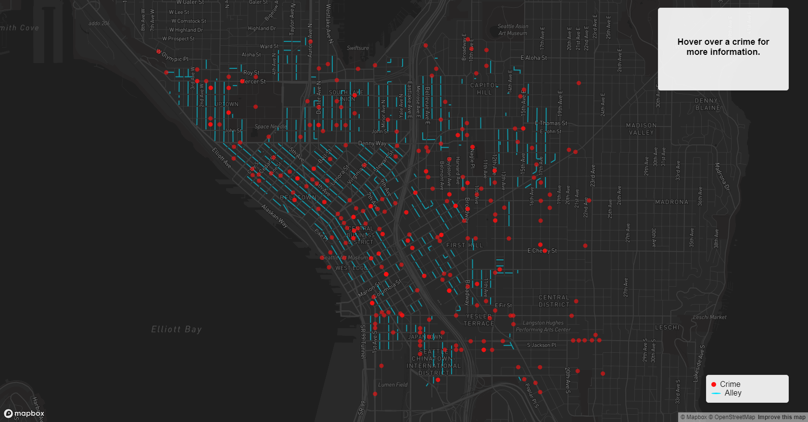

# Seattle Alleys And Crimes
*Armaan Azeem*

## Description
This application maps the alleyways of Greater Downtown Seattle and instances of crime in 2023. 

## Project Goal
The goal of this project is to explore and visualise the geospatial relationship between alleyways and crimes in the Greater Downtown Seattle area. The target audience of this map is Seattle residents, government officials, researchers and the general public interested in understanding this geospatial relationship.

Application URL: https://prodarmaan.github.io/SeattleAlleyCrimes/

## Map Preview

## Main Functions
- Interactive Hover over crime layer to view details

## Data Sources
- [Greater Downtown Alleys](https://data-seattlecitygis.opendata.arcgis.com/datasets/SeattleCityGIS::greater-downtown-alleys/explore?location=47.614458%2C-122.329729%2C15.67)
- [Crime Rate In Top 10 Most Populated Areas In Seattle](https://data.seattle.gov/Public-Safety/Crime-Rate-In-Top-10-Most-Populated-Areas-In-Seatt/f6cr-gwvc)

## Active Applied Libraries & Web Services
- Mapbox GL JS
- Mapbox Basemap
- Github 
